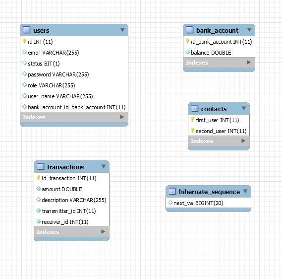

# PayMyBuddy

## Table of Content

* [Technical Informations](#1-technical-informations)
    * [Requirements](#11-requirements)
    * [Diagrams](#12-diagrams)
    * [Sql Scripts](#13-sql-scripts)
    * [Installation](#14-installation)


* [Points of attention](#4-points-of-attention)

## Description

PayMyBuddy --- money transferts between friends
</br>
</br>

## 1. Technical informations

### 1.1 Requirements and Technical information


</br>
</br>

### 1.2 Diagrams



</br>
</br>

### 1.3 SQL Scripts

Create the 'pbud' database then you find the sql script in the ressources folder:

* pbud.sql containing and init files(not required if you register user)
  </br>
  </br>

PS: if you want to create automatically the tables in your db you need to specify the creation mode
in propreties file

Important note:
Change the propreties.file according to your username and password

### 1.4 Installation

* Export project with:

```bash
mvn clean
mvn install
```

As Tomcat is embbeded, you can launch directly the *.jar with

```bash
java -jar {nameOfTheFile}.jar
```

You find the JaR file in your target folder.

## 2 Points of attention

* To send money, you have to follow these steps in order.</br></br>

    1. Register min 2 users </br></br>

    2. Login and add a contact connection in the existing user list that can be added (Don't add the same
       user 2 times) </br></br>

    3. In the profile add funds to your account (all transactions have 5% fare costs) </br></br>
    4. In your transfer menu you can send money to your connections </br></br>


* Do not register the same username twice.</br></br>